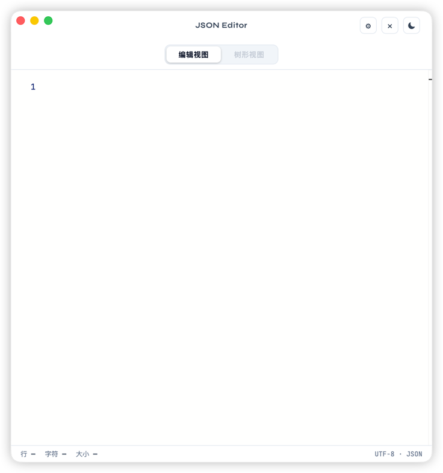

# JSON Editor — Tauri + React + Monaco Editor

English | [中文](./README.zh.md)

A lightweight and beautiful JSON formatting desktop editor, supporting macOS and Windows.

<div align="center">
  
</div>

## Tech Stack

| Layer | Technology |
|---|---|
| Desktop Framework | Tauri 2.0 |
| Backend Logic | Rust (serde_json) |
| UI Framework | React 18 + TypeScript |
| Editor Component | Monaco Editor (same as VS Code) |
| Styling | Plain CSS (no framework) |
| Build Tool | Vite 5 |

## Features

- ✅ Real-time JSON syntax validation (Monaco editor error highlighting)
- ✅ Tree structure preview (support expand all / collapse all)
- ✅ One-click switch between editor view and tree view
- ✅ Copy to clipboard (supported in both editor and tree views)
- ✅ Auto-read clipboard JSON and format on window focus
- ✅ File size / line count / character count (bottom status bar)
- ✅ Light / Dark theme toggle
- ✅ macOS / Windows support
- ✅ AI-assisted repair (supports Claude / DeepSeek, auto-fixes common JSON errors or provides explanations)

## Local Development

### Prerequisites

**macOS**

```bash
# 1. Install Rust
curl --proto '=https' --tlsv1.2 -sSf https://sh.rustup.rs | sh

# 2. Install system dependencies
xcode-select --install

# 3. Install Node.js (v18+ recommended)
brew install nvm && nvm install 20
```

**Windows**

```powershell
# 1. Install Rust (download rustup-init.exe from the official site)
# https://rustup.rs

# 2. Install Visual Studio C++ Build Tools (required for Rust compilation)
# Check "Desktop development with C++" in Visual Studio Installer

# 3. Install Node.js (v18+ recommended, download from nodejs.org)
```

### Getting Started

```bash
# Navigate to the project directory
cd json-editor-tauri

# Install npm dependencies
npm install

# Start development mode (auto-opens desktop window + hot reload)
npm run tauri dev
```

### Build for Production

```bash
# Build the application bundle (output in src-tauri/target/release/bundle/)
# macOS: generates .app / .dmg
# Windows: generates .exe / .msi
npm run tauri build
```

## Project Structure

```
json-editor-tauri/
├── src/                    # React frontend
│   ├── App.tsx             # Main component
│   ├── App.css             # Styles
│   └── main.tsx            # Entry point
├── src-tauri/              # Rust backend
│   ├── src/
│   │   ├── main.rs         # Program entry
│   │   └── lib.rs          # Tauri commands (format/minify/validate)
│   ├── Cargo.toml          # Rust dependencies
│   └── tauri.conf.json     # Tauri config (window, bundle, etc.)
├── index.html
├── vite.config.ts
└── package.json
```
